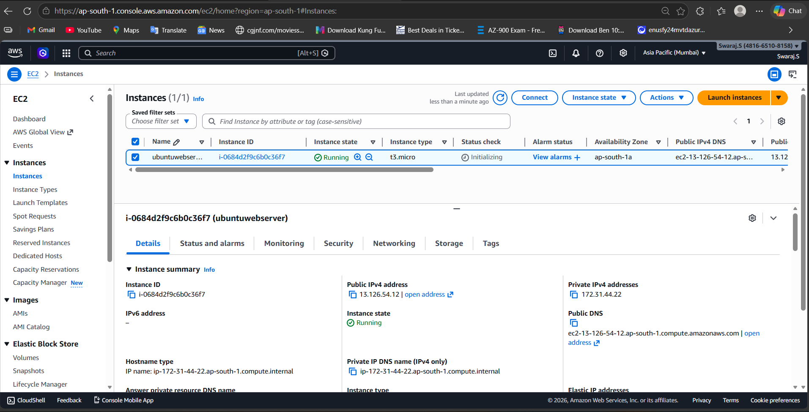
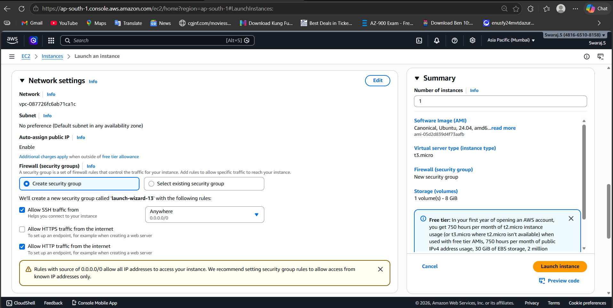
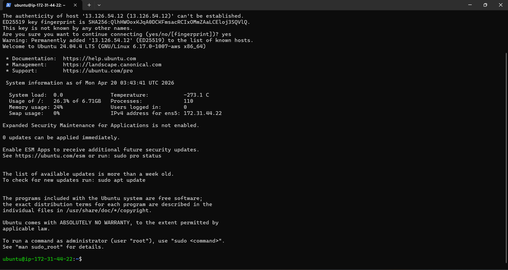
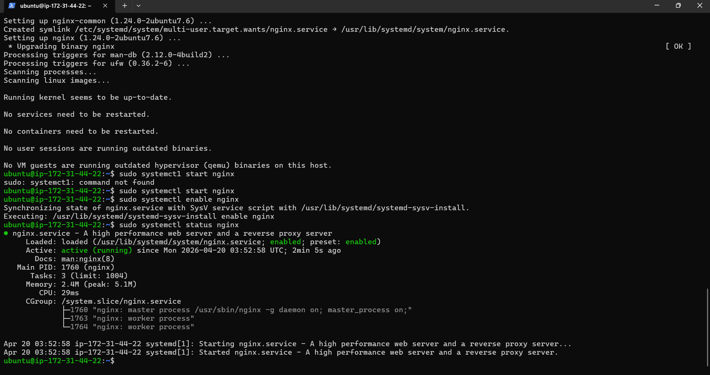
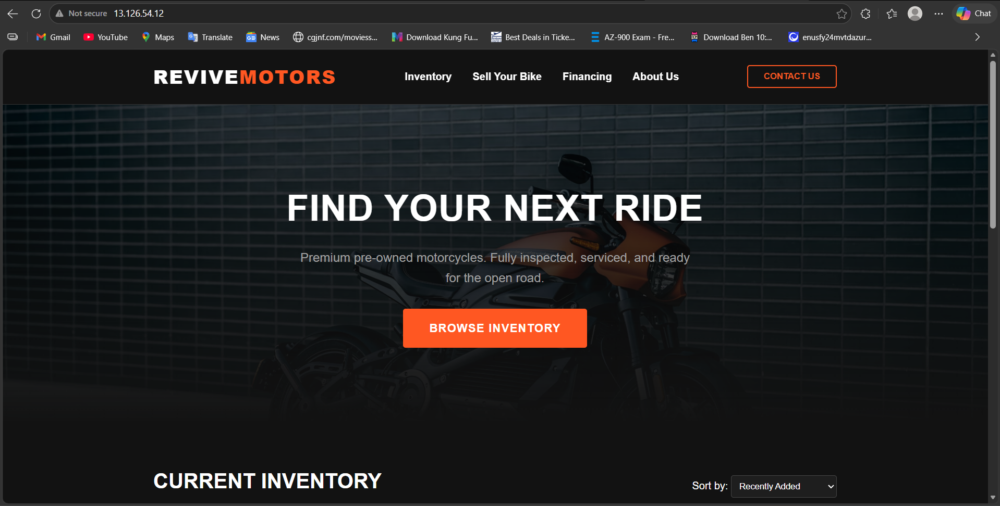

# 🚀 AWS EC2 Web Deployment using Nginx

---

## 📌 Project Overview

This project demonstrates deploying a static website on a cloud server using AWS EC2 and Nginx.

It includes launching a virtual machine, configuring network access, connecting via SSH, and hosting a website using a Linux-based web server.

---

## 🏗️ Architecture

User → EC2 Instance → Nginx → Website

---

## ⚙️ Implementation Steps

### 🔹 Step 1: Launch EC2 Instance
- Created an EC2 instance (Ubuntu)
- Configured key pair for secure access

---

### 🔹 Step 2: Configure Security Group
- Allowed inbound traffic:
  - SSH (Port 22)
  - HTTP (Port 80)

---

### 🔹 Step 3: Connect via SSH
- Connected to EC2 instance using SSH
- Accessed Linux terminal remotely

---

### 🔹 Step 4: Install & Run Nginx
- Installed Nginx web server
- Started and enabled service

---

### 🔹 Step 5: Deploy Website
- Uploaded custom HTML website
- Hosted via EC2 public IP

---

## 🌐 Final Result

✅ Website successfully deployed on AWS EC2  
✅ Accessible via public IP  
✅ Nginx configured and running  

---

## 🛠️ Tech Stack

- AWS EC2  
- Ubuntu Linux  
- Nginx  
- HTML, CSS  

---

## 📚 Learning Outcomes

- Cloud server deployment using EC2  
- Security group and networking configuration  
- SSH-based remote access  
- Nginx installation and management  
- Hosting a real web application  

---

## 🚀 Future Improvements

- Add domain using Route 53  
- Enable HTTPS (SSL)  
- Integrate CloudFront CDN  
- Automate deployment  

---

## 👨‍💻 Author

Swaraj Sutradhar
